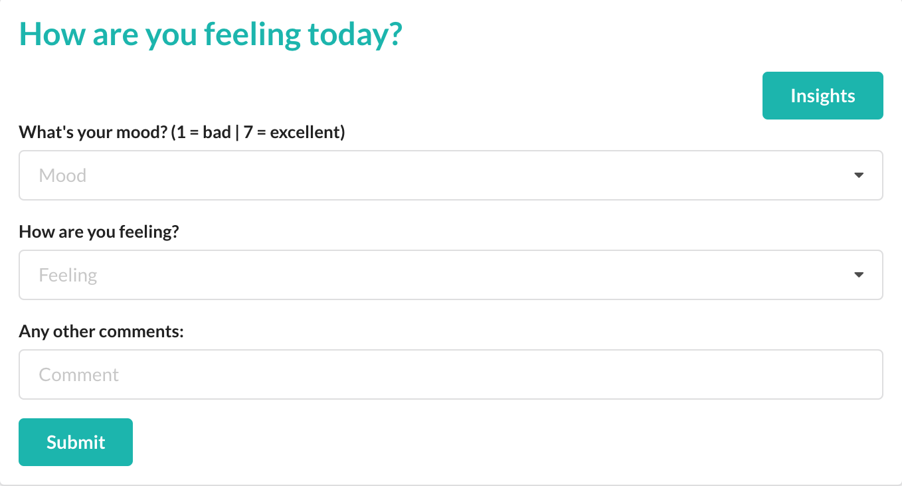
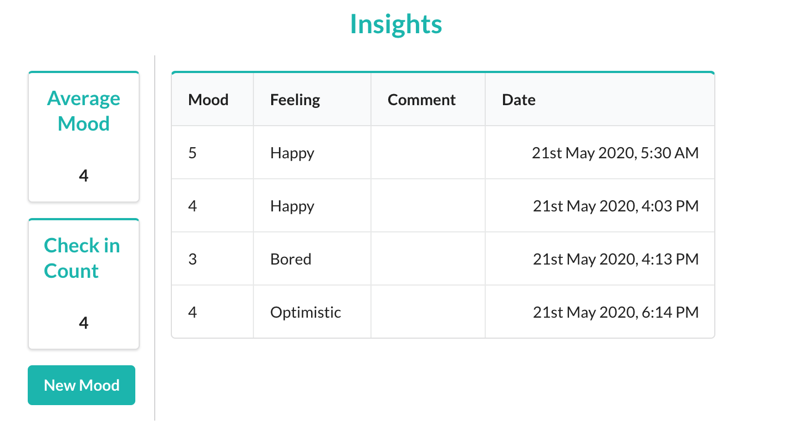

# Mood

REST API Server built with Express and TypeScript, with a React frontend to allow a user to perform a mood check in and see insights about their mood.

### To Do:

- Fix tests

## Run:

Server:

```
cd server
cp .env-example .env
npm install
npm start
npm test
```

Frontend:

```
cd frontend
cp .env-example .env
npm install
npm start
npm test
```

## Navigate to:

```
http://localhost:3000 // frontent form
http://localhost:3000/insights // frontend insights
http://localhost:3001/moods // to see the server response
```

### It should look a little something like this:



